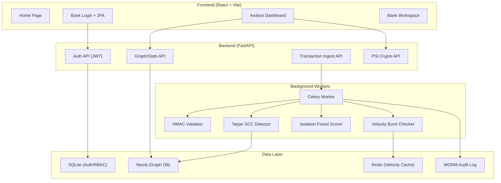
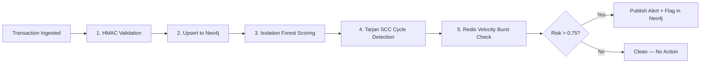

# DULHAN — Complete Application Overview

## What Is Dulhan?

**Dulhan** is a **B2B fintech security intelligence platform** designed for Indian banks and financial institutions. Its core purpose is to **detect and destroy multi-hop money laundering networks** (like smurfing, circular transactions, and velocity-based fraud) in real-time by collaboratively analyzing transaction graphs **across multiple banks** — all while preserving user privacy through zero-PII (Personally Identifiable Information) cryptographic techniques.

Think of it as: *"A shared fraud detection brain for banks that can see the bigger picture without any single bank exposing its customer data."*

---

## Tech Stack

| Layer | Technology | Purpose |
|---|---|---|
| **Frontend** | React + TypeScript + Vite | Premium dashboard UI |
| **Styling** | TailwindCSS | Glassmorphic, modern design |
| **Animations** | Framer Motion | Page transitions, micro-animations |
| **3D Visualization** | `react-force-graph-3d` + Three.js | Interactive threat topology graph |
| **Backend API** | FastAPI (Python) | REST API, JWT auth, transaction ingestion |
| **Graph Database** | Neo4j | Stores accounts & transaction relationships |
| **Relational DB** | SQLite | Institution auth, RBAC roles |
| **Task Queue** | Celery + Redis | Async fraud analysis pipeline |
| **ML Engine** | Scikit-learn (Isolation Forest) | Anomaly scoring |
| **Graph Algorithms** | NetworkX (Tarjan SCC) | Cycle detection in transaction graphs |
| **PDF Reports** | jsPDF | STR (Suspicious Transaction Report) generation |
| **Audit Logging** | WORM log file | Immutable compliance audit trail |

---

## Architecture Diagram

---

## Frontend Pages

### 1. Home Page (`/`)
[Home.tsx](file:///d:/dulhan/Dulhan.sec/frontend/src/pages/Home.tsx)

The landing page with:
- **Hero Section** — Interactive grid that follows mouse movement, with animated gradient background and "Bank Portal" CTA button
- **Impact Telemetry Suite** — Real-time stats dashboard showing accounts analyzed, threat interceptions, and capital protected (animated counters)
- **Node Compromise Checker** — An interactive input where users can paste a bank account hash to check if it appears in known breach datasets (simulated)
- **Partner Bank Marquee** — Auto-scrolling logos of federated partner banks (Axis, ICICI, SBI, etc.)
- **The Problem Section** — Explains mule networks and smurfing fraud with floating imagery
- **The Solution Section** — Four feature cards (Cross-Bank Inspector, Deterministic Heuristics, Graph-Based Threat Topology, Adaptive Neural Scoring) using spotlight glow effects

### 2. Login Page (`/login`)
[BankLogin.tsx](file:///d:/dulhan/Dulhan.sec/frontend/src/pages/BankLogin.tsx)

Three-view authentication flow:
- **Step 1 — Credentials**: Institution ID + Password → calls `POST /api/auth/login`
- **Step 2 — Two-Factor Auth**: 18-digit hardware token input. Has a **"Simulate HSM-App Approval"** button that auto-generates a random code and submits (this is the demo bypass)
- **Registration View**: Mock bank onboarding form (Institution Name, CIN/IFSC, Compliance Email)
- On success, stores JWT token in `localStorage` and redirects to `/dashboard`

### 3. Dashboard (`/dashboard`) — Protected Route
[Dashboard.tsx](file:///d:/dulhan/Dulhan.sec/frontend/src/pages/Dashboard.tsx)

The main analyst workspace with a dark sidebar and **10 tabs**, gated by role-based access (RBAC):

| Tab | Access | Description |
|---|---|---|
| **Compliance Runner** | All roles | Runs 11 diagnostic tests (HMAC, Replay Attack, Tarjan SCC, Velocity Burst, etc.) with animated results |
| **Threat Intelligence** | All roles | **3D interactive force-directed graph** (1,000 nodes) showing transaction topology. Orange nodes = flagged threats, green = clean. Click a flagged node to trigger simulated cross-bank verification. Includes anomaly sensitivity slider and live threat feed |
| **Intelligence Trends** | Supervisor+ | Historical trend charts and analytics |
| **System Impact** | All roles | Impact metrics dashboard with animated counters |
| **Operations SLA** | Admin only | System latency and SLA monitoring |
| **Bank Onboarding** | Admin only | Onboard new institutional nodes |
| **Zero-PII Prover** | Supervisor+ | Interactive HMAC-SHA256 demo — type raw account data and see it irreversibly hashed in real-time |
| **Advanced Crypto (PSI)** | Supervisor+ | Private Set Intersection — match suspicious tokens across two banks without exposing raw data |
| **Federated Sync** | Supervisor+ | Shows federated learning model sync stats (Local Accuracy, Global Precision, Sync Cycle) |
| **Settings & Audit** | Admin only | Toggle WORM audit logging, edge node protection, key rotation |

The dashboard also features:
- **Threat Resolution Panel**: When a Tarjan SCC cycle is detected, analysts can "Manual Flag", "Flag to RBI Investigation", or "Clean Record"
- **STR PDF Generator**: Downloads Suspicious Transaction Reports as PDFs
- **5-second auto-polling** for real-time data refresh
- **Bottom status bar** with node connection status

### 4. Bank Workspace (`/bank-workspace`) — Protected Route
[BankWorkspace.tsx](file:///d:/dulhan/Dulhan.sec/frontend/src/pages/BankWorkspace.tsx)

Individual bank's transaction view:
- Transaction table with search/filter
- Stats: Total Telemetry, Anomalies Detected, Network Stability
- PDF audit report export via `jsPDF + autoTable`

### 5. About Page (`/about`)
[AboutUs.tsx](file:///d:/dulhan/Dulhan.sec/frontend/src/pages/AboutUs.tsx)

Team page showing the four developers with floating profile cards and role descriptions.

---

## Backend API Endpoints

[main.py](file:///d:/dulhan/Dulhan.sec/main.py)

| Method | Endpoint | Auth | Description |
|---|---|---|---|
| `GET` | `/` | No | Health check — returns API status and version |
| `POST` | `/api/auth/register` | No | Register a new institution (bank_name, institution_id, compliance_email, password) |
| `POST` | `/api/auth/login` | No | Login with institution_id + password → returns JWT token + role |
| `GET` | `/api/auth/me` | JWT | Get current institution's profile |
| `GET` | `/transactions` | JWT | Fetch last 100 transactions from Neo4j graph |
| `GET` | `/accounts` | JWT | List all account nodes from Neo4j |
| `GET` | `/api/threat-stats` | JWT | Aggregate stats: total accounts, transactions, flagged networks, frozen capital |
| `GET` | `/api/graph` | JWT | Get flagged nodes + their neighbors for 3D visualization |
| `POST` | `/ingest_transaction` | JWT | Ingest a new transaction edge (with HMAC validation + replay attack prevention) → queues Celery task |
| `POST` | `/api/psi/intersect` | JWT | Private Set Intersection — find matching tokens between two banks' encrypted datasets |

---

## Fraud Detection Pipeline

When a transaction is ingested via `/ingest_transaction`, the Celery worker ([tasks.py](file:///d:/dulhan/Dulhan.sec/tasks.py)) runs this pipeline:

### Detection Algorithms

1. **HMAC-SHA256 Integrity** — Every transaction payload includes a cryptographic signature. Tampered payloads are rejected immediately.

2. **Replay Attack Prevention** — Timestamps must be within 5 minutes of server time.

3. **Isolation Forest (ML)** — Unsupervised anomaly detection model scores each account based on degree (connections) and volume (total transaction amount). Outliers get low scores.

4. **Tarjan's Strongly Connected Components** — Uses NetworkX to find directed cycles in the 3-hop subgraph around a sender. Cycles > 1 node indicate potential circular money laundering. If composite risk > 0.75, nodes are flagged.

5. **Velocity Burst Detection** — Redis counts transactions per sender in 10-minute windows. More than 8 transactions in a window triggers a `VELOCITY_BURST` alert.

---

## Data Storage Details

### SQLite (`fintech_threat_db.sqlite`)
Located at: `d:\dulhan\Dulhan.sec\fintech_threat_db.sqlite`

| Table | Purpose |
|---|---|
| `institutions` | Bank accounts for login (id, bank_name, institution_id, compliance_email, hashed_password, role) |
| `banks` | Bank branch registry (branch_code, bank_name, hashed_password) |
| `accounts` | Local account index (account_id, bank_id, account_type, risk_status) |
| `transactions` | Local transaction index (txn_id, sender, receiver, amount, timestamp, is_flagged, fraud_pattern) |

### Neo4j (Graph Database)
Connection: `bolt://localhost:7687`

- **Nodes**: `:Account` — properties: `token`, `bank_id`, `account_type`, `risk_status`, `is_flagged`, `if_score`
- **Relationships**: `:TRANSFERRED_TO` — properties: `txn_id`, `amount`, `timestamp`, `is_flagged`, `fraud_pattern`, `channel`, `risk_hints`, `epoch`

### Redis
Connection: `localhost:6379`
- **DB 0**: Celery task broker
- **DB 1**: Velocity counter cache (keys like `vel:{sender_token}:{time_window}`, TTL 30 minutes)

### WORM Audit Log
File: `d:\dulhan\Dulhan.sec\dulhan_audit_worm.log`
- Append-only immutable log of all security events (logins, PSI intersections, threat alerts, API ingestions)
- Used for regulatory compliance evidence

---

## Security Features

| Feature | Implementation |
|---|---|
| **Zero-PII** | Account numbers are HMAC-SHA256 hashed before storage — raw PII never enters the graph |
| **JWT Authentication** | HS256 tokens with 1-hour expiry and issuer verification (`dulhan.neural.core`) |
| **RBAC** | 3 roles: `analyst`, `supervisor`, `admin` — each role gates specific dashboard tabs |
| **2FA Simulation** | 18-digit hardware token challenge before dashboard access |
| **HMAC Payload Signing** | Every ingested transaction must include a valid HMAC signature |
| **Replay Attack Prevention** | Transaction timestamps verified within 5-minute window |
| **WORM Audit Trail** | Immutable append-only log for all system events |
| **Private Set Intersection** | Cross-bank data matching without exposing raw datasets |
| **Federated Learning** | Model weights shared between banks, raw data never leaves the institution |

---

## Demo Accounts

| Institution ID | Password | Role | Dashboard Access |
|---|---|---|---|
| `BNK-HDFC` | `password123` | `admin` | All 10 tabs |
| `BNK-SBI` | `password123` | `supervisor` | 8 tabs (no Operations SLA, no Settings) |
| `BNK-ICICI` | `password123` | `analyst` | 4 tabs (Compliance, Intelligence, Impact, System Impact) |
| `BNK-AXIS` | `password123` | `analyst` | Same as ICICI |
| `BNK-KOTAK` | `password123` | `analyst` | Same as ICICI |

---

## Seeded Fraud Patterns

When `generate_threat_network.py` runs with Neo4j, it seeds:

1. **50-to-1 Smurfing Hub** — 50 accounts funnel ₹49,000 each into one receiver (just under reporting thresholds)
2. **15-Node Tarjan Cycle** — Circular money laundering ring where funds loop through 15 accounts
3. **Velocity Burst** — 1 sender fires 30 transactions in 2 minutes to the same receiver

These patterns are pre-flagged with `is_flagged: 1` and visible in the 3D threat graph as orange clusters.
